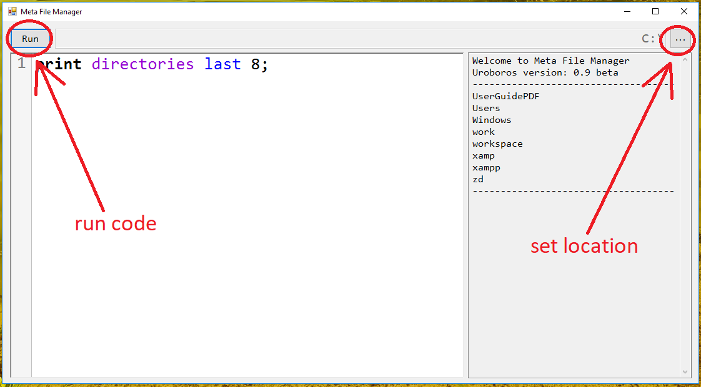

Quick Guide
=====================

Welcome to Quick Guide, the easiest way to start with Uroboros.

---

# **Let's Go**

Run gui application. When it is opened, you have to select one directory from your drive. It is necessary, because Uroboros actions are 
based on manipulating files and directories from selected location. You can select location by the top right button.



When location is selected, everything is ready.

---

# **First Code**

```
print "hello world";
```

Try to run this code. This is Print, the basic command. It can print anything in log - texts, lists, numbers, time.

```
"hello world";
```

Print is default command and you can omit first keyword, however it is recommended to keep it for greater readability. Two first codes
make the same result.

```
print 2+2*2;
```

Print can be used to print numbers and operations on them (+ ,- ,* , /, %).

```
print "2+2*2 = " + 2+2*2;
```

Text and numbers can be merged by the use of pluses.

```
6 => print "hello world";
```
If you want to repeat one command several times, you can use Big Arrow or curly brackets. This structure is called Numeric Loop.

```
6 { 
   print "hello world"; 
} 
```
Curly brackets allow to repeat more than one command, for example:

```
6 { 
   print "hello"; 
   print " world"; 
} 
```

As you can see, two commands are executed after each other six times.

```
2 => 2 => print "hello";
```

Big arrows and curly brackets can be nested in various configurations. 

```
10 => print "Index = " + index;
```

Numeric Loops have one variable related with them - "index". Index is number of current turnover of loop, starting from 0. If loops
are nested, index refers to the last one.

```
print files;
```

Variable "files" returns list of all files from current location (location selected at the beginning of the program). If there are no
files, nothing is printed from command above. Location can be changed by user any time.

```
print "-------------------- directories:";
print directories;
print "-------------------- files:";
print files;
print "-------------------- everything:";
print everything;
```

The other two important variables are "directories" and "everything". Variable "directories" returns all directories and variable
"everything" returns all directories and all files (in this order).

```
files => print "file";
```

List Loop is a structure similar to Numeric Loop. It can be created by use of Big Arrow or curly brackets. It performs command for
every element in list. So for example, if list contains 20 elements, command will be executed 20 times.

```
files => print this;
```

List Loops have one variable related with them - "this". It is name of current taken element from list. List Loops, like Numeric Loops,
use variable "index".

```
files => print "File No. " + index + ": " + this;
```

As you can see, both "index" and "this" change for every element from list.

```
files { 
   print "File = " + this;
   print "  Extension = " + extension;
   print "  Size = " + size;
   print "  Creation Year = " + creation.year;
   print "  Creation Month = " + month(creation.month);
}
```

List Loop can be used to extract properties of files, as seen above. If you want to know more about properties of files, go to 
[inner variables](documentation/InnerVariables.md).

```
v = 2 * 3;
v *= 4;
s = "V equals " + v;
print v;
print s;
```

Uroboros allows to use variables and they are (like all data structures) of five types: Logic, Number, Time, Text, List. For more
information about data types go to [data types](documentation/DataTypes.md). Variables are dynamically typed.

```
files{
   print size + "  " + this;
   if size > 1MB{
      print "  It is so big!";
   }
}
```

Structure If executes commands in curly brackets only if condition is satisfied. Comparing conditions use characters: >, >=, <, <=,
!=, =.

```
files{
   print size + "  " + this;
   if size > 1MB{
      print "  It is so big!";
   }
   else{
      print "  It is small.";
   }
}
```

Aditional structure Else executes commands only if condition in If is not satisfied.

```
variable = 1;

while variable <= 10{
   print variable;
   variable++;
   sleep 0.1;
}
```

Structure While executes commands in loop as long as condition is true.

```
print files first 10;
```

If you want to take part of existing list, you can use subcommands. Subcommands are executed chronologically as they appear.

```
print files 
   first 10 
   last 5;
```

As you can see, selected are last 5 files of first 10 files.

```
print files 
   order by size desc 
   first 6;
```

Command above selected 6 biggest files from directory (by size).


```
print files 
   where extension = "txt"
   first 5;
```

This subcommand selected first 5 files with extension "txt".

```
t = 1 month before now;

print files 
   where extension is "pdf"
   and creation is before t;
```

Conditions in Where can be joined by "and", "or", "xor" and their equivalents &, |, ^. Conditions can be grouped by brackets (). 
There are many other subcommands so if you want to know more, go to [data types](documentation/DataTypes.md). Subcommands are described
at the bottom of document.

```
l = 2, 3+6, "ghg";
print l;
```

Lists can be created by mentioning all elements with commas between them.

```
l = 2, 3+6, "ghg";
s = l, 4, 0;
remove 2 from s;
add "some text" to s;
order s by fullname;
print s;
```

Commands AddTo and RemveFrom can be used to modify existing list variables. Command Order changes order of elements.

```
number = 10;
SET = 2,35, 12, number/2;
SET => print number(this) * 100;
```

All elements in list are treated as text and mathematical operations cannot be performed on them. To avoid this problem, you can use
function Number.

```
n = "John Doe";
print lower(n);
print upper(n);
print substring(n, 1);
print substring(n, 5, 2);
print digits(n);
print letters(n);
```

There are many other interesting functions. If you want to know them, visit [functions](documentation/Functions.md).

```
e = files -> extension + "__" + creation.year;
print e;
```

If you want to make new list based on another list, you can use Small Arrow Function. Function above takes extension and
creation year of every file.

```
e = files -> unique extension;
print e;
```

Keyword "unique" is used to mark, that new list cannot have duplicates.


```
sizes = 1KB, 5MB, 100GB, 1K, 50K;
print sizes;
```

Numbers can have sufixes. They are their multipliers. For example sufix KB multiplies number by 1024. It is the number of bytes in
one kilobyte. Sufixes are useful for comparing sizes of files, because variable "size" return integer (number of bytes).

```
print 12:31;
print 3 june;
print 21 april 2006;
print 2 april 2005, 21:37;
print 15 november, 12:45:41;
print date(3,12,2010);
print christmas(2008);
print easter(2072);
```

Uroboros contains facilities for writing dates and times. Dates can be written in many different ways. If definition of time do not
contain clock (hour, minute, second), it is set to 0. If it do not have year, year from system time is set. The same goes for date.


   
