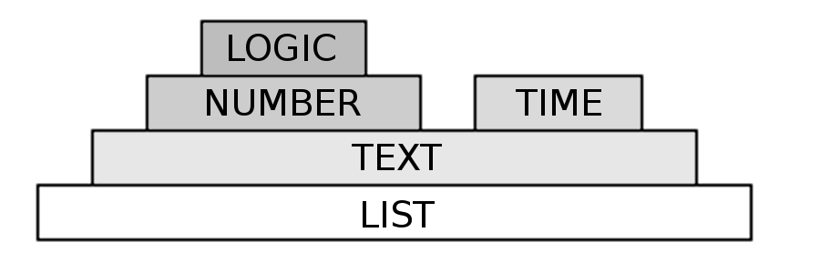

Data Types
=====================

In Uroboros every data structure is one of five types: Logic, Number, Time, Text, List.
Data types in some situations can be treated as different ones. 
Logic type can be treated as: Number, Text, List.  
Number type can be treated as: Text, List.  
Time type can be treated as: Text, List.  
Text type can be treated as List.  
List type can be treated only as itself.  
   
These properties are shown in pyramid image: every data type can be treated as another under it.

---

# **Logic**

Logic type can have only two values: "true" and "false". When treated as number, "true" is returned as 1 and "false" is returned as 0. The same goes when treating it as text and list (returned is one-element list with text "0" or "1"). 

### Logic Constants

The easiest way to initiate value of logic type is to use two keywords: "true" and "false". They are insensitive to case size.

### Comparisons By Keywords

Two data structures of the same data type can be compared by the use of "is". If two values are the same, "true" is returned.

| Structure | Returns |
| --------- | ------- |
| [logic] **is** [logic] | (Logic) |
| [number] **is** [number] | (Logic) |
| [time] **is** [time] | (Logic) |
| [text] **is** [text] | (Logic) |
| [list] **is** [list] | (Logic) |

An analogous structure can be created using an additional key: "not". This is negation of equality - structure returns true if two values ((arg1) and (arg2)) are different.

| Structure | Returns |
| --------- | ------- |
| [logic] **is** **not** [logic] | (Logic) |
| [number] **is** **not** [number] | (Logic) |
| [time] **is** **not** [time] | (Logic) |
| [text] **is** **not** [text] | (Logic) |
| [list] **is** **not** [list] | (Logic) |

### Comparisons By Signs

Alternative way for checking equality is by the use of signs "=" or "==" (there is not difference between them).

| Structure | Returns |
| --------- | ------- |
| [logic] **=** [logic] | (Logic) |
| [number] **=** [number] | (Logic) |
| [time] **=** [time] | (Logic) |
| [text] **=** [text] | (Logic) |
| [list] **=** [list] | (Logic) |

Inequality can be checked by the use of "!=".

| Structure | Returns |
| --------- | ------- |
| [logic] **!=** [logic] | (Logic) |
| [number] **!=** [number] | (Logic) |
| [time] **!=** [time] | (Logic) |
| [text] **!=** [text] | (Logic) |
| [list] **!=** [list] | (Logic) |

Checking a smaller / larger value is done by using ">", "<", ">=", "<=". For logic and numeric types, result is intuitive comparison of numbers. For time type, it is checking which of two time values is first chronologically. For text type, alphabetical order is used to dermine which text is "smaller". For list, compared is list length.

| Structure | Returns |
| --------- | ------- |
| [logic] **>** [logic] | (Logic) |
| [number] **>** [number] | (Logic) |
| [time] **>** [time] | (Logic) |
| [text] **>** [text] | (Logic) |
| [list] **>** [list] | (Logic) |
| Analogically for: "<", ">=", "<=" |

### Comparisons Of Time

Alternative way for comparing time is by the use of "is after" and "is before".

| Structure | Returns |
| --------- | ------- |
| [time] **is** **after** [time] | (Logic) |
| [time] **is** **before** [time] | (Logic) |

### In

Structure "in" returns true, is text (arg1) can be found inside list (arg2).

| Structure | Returns |
| --------- | ------- |
| [text] **in** [list] | (Logic) |

### Like

Structure "like" is similiar to that of language SQL. It checks, if text (arg1) fits phrase (arg2), which is text constant. Phrase text has 3 special characters.   
Character _ represents any character and its appearance is required.  
Character # represents any digit and its appearance is required.  
Character % represents any number of character and their appearance is not required - text here can be empty as well.  
Other characters represent appearance of themselves.

| Structure | Returns |
| --------- | ------- |
| [text] **like** [text constant] | (Logic) |

### Logic Functions

See: [functions](Functions.md).

### Logic Expressions

Logic expressions are many logic structures connected by logic operators: **and**, **or**, **xor**, **not** and their sign equivalents: &, |, ^, !. Elements can be grouped by brackets () to determine the order of operations.

| Structure | Alternative Structure | Returns | Meaning |
| --------- | --------------------- | ------- | ------- |
| [logic] **and** [logic] | [logic] **&** [logic] | (Logic) | [conjuction](https://en.wikipedia.org/wiki/Logical_conjunction) |
| [logic] **or** [logic] | [logic] &#124; [logic] | (Logic) | [disjunction](https://en.wikipedia.org/wiki/Logical_disjunction) |
| [logic] **xor** [logic] | [logic] **^** [logic] | (Logic) | [exclusive disjunction](https://en.wikipedia.org/wiki/Exclusive_or) |
| **not** [logic] | **!** [logic] | (Logic) | [negation](https://en.wikipedia.org/wiki/Negation) |

---

# **Number**

Number data type can be used for storing numbers with finite decimal expansion.

### Numeric Constants

Numeric constants can be created by simply typing few consecutive digits with one dot inside as decimal separator (but it is not necessary). Sign "-" before number makes it negative.

### Numeric Variable From Time

Some data like year or day of week can be outstretched from existing time variables.

| Structure | Returns |
| --------- | ------- |
| [time variable] **.year** | (Number) |
| [time variable] **.month** | (Number) |
| [time variable] **.weekday** | (Number) |
| [time variable] **.day** | (Number) |
| [time variable] **.hour** | (Number) |
| [time variable] **.minute** | (Number) |
| [time variable] **.second** | (Number) |

        
### Numeric Functions

See: [functions](Functions.md).

### Numeric Expressions

Numeric expressions are many numeric structures connected by arithmetic operators: +, -, /, *, %. Elements can be grouped by brackets () to determine the order of operations.

| Structure | Returns | Meaning |
| --------- | ------- | ------- |
| [number] **+** [number] | (Number) | [addition](https://en.wikipedia.org/wiki/Addition) |
| [number] **-** [number] | (Number) | [substraction](https://en.wikipedia.org/wiki/Subtraction) |
| [number] * [number] | (Number) | [multiplication](https://en.wikipedia.org/wiki/Multiplication) |
| [number] / [number] | (Number) | [division](https://en.wikipedia.org/wiki/Division_(mathematics)) |
| [number] % [number] | (Number) | [modulo](https://en.wikipedia.org/wiki/Modulo_operation) |

# **Time**

Time type stores one moment in time: year, month, day, hour, minute, second. 24-hour clock is used.

### Time From Clock

When creating time from clock, its date is set to current system date. If number of seconds is ommited, it becomes 0. Arguments are in sequence: hour, minute, second.

| Structure | Returns |
| --------- | ------- |
| [number] : [number] : [number] | (Time) |
| [number] : [number] | (Time) |

### Time From Date

There are two ways for creating time from date : with year or without year. When year is lacking, its value is set to year from current system time. First argument is day, third argument is year. Second argument is month name - it is insensitive to case size. Values for hour, minute and second are set to 0.

| Structure | Returns |
| --------- | ------- |
| [number] [english month name] [numer] | (Time) |
| [number] [english month name] | (Time) |

### Time From Date And Clock

This structure combines creation time from date and from clock. Date and clock part are divided by a comma.

| Structure | Returns |
| --------- | ------- |
| [number] [english month name] [numer] , [number] : [number] : [number] | (Time) |
| [number] [english month name] , [number] : [number] : [number] | (Time) |
| [number] [english month name] [numer] , [number] : [number] | (Time) |
| [number] [english month name] , [number] : [number] | (Time) |

### Time From Time And Clock

This structure takes existing time and changes its clock: values for hour, minute, second.

| Structure | Returns |
| --------- | ------- |
| [time] , [number] : [number] : [number] | (Time) |
| [time] , [number] : [number] | (Time) |

### Relative Time

Relative Time structure takes existing time and moves it by particular period of time. It consists of many relative time structs (one or more) and one definition of referent time (last arg).

| Structure | Returns |
| --------- | ------- |
| [relative time struct]...[relative time struct] [time] | (Time) |

